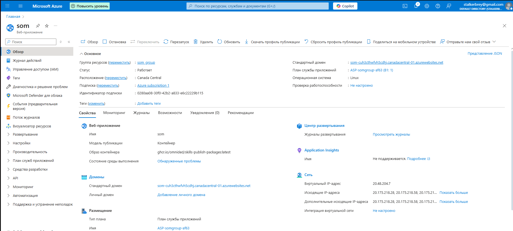
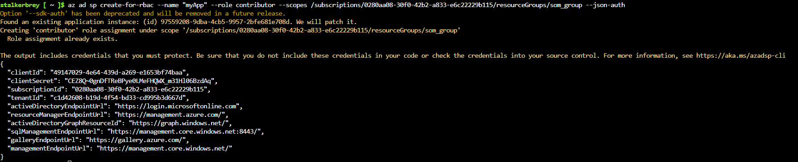
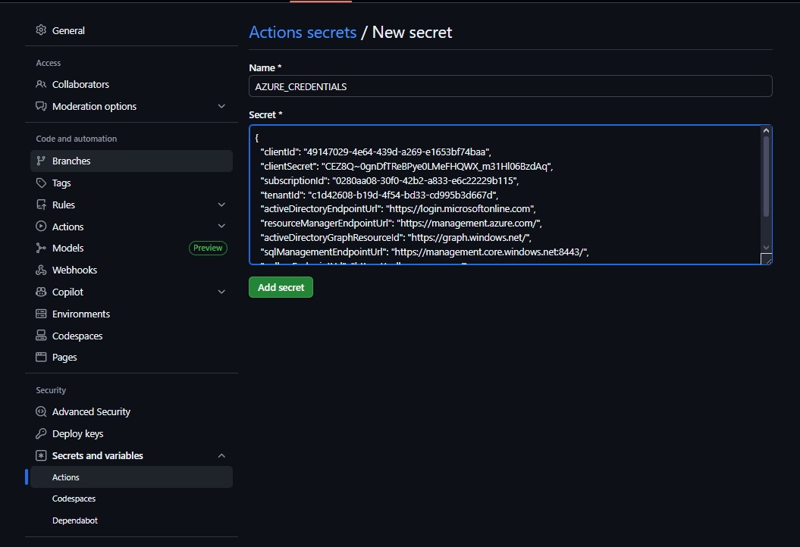
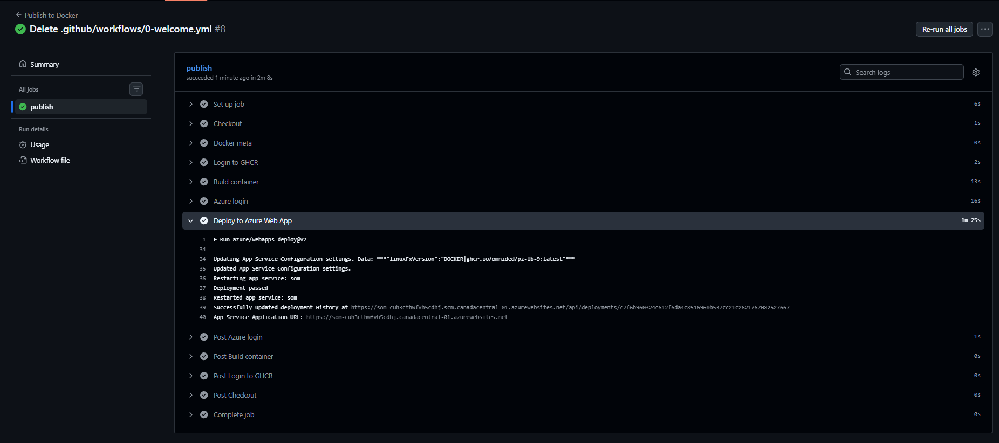
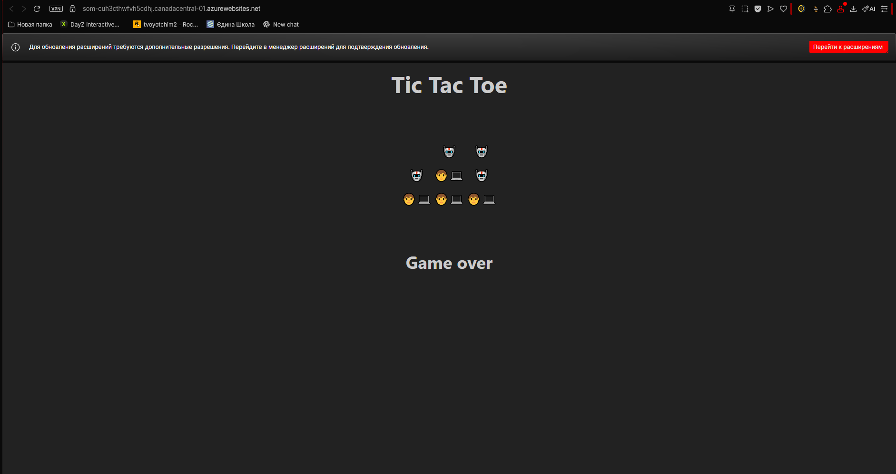

# Звіт з лабораторної роботи: Деплой Docker-контейнера в Azure App Service

## 1. Створення ресурсів в Azure

Згідно із завданням, у власній підписці Azure було створено необхідні ресурси:

1.  **Ресурсна група (Resource Group):** Створено нову групу для проєкту.
2.  **App Service:** Створено веб-додаток із наступними параметрами:
    * **Publish:** Docker Container (деплой контейнеру).
    * **Operating System:** Linux.
    * **Pricing Plan:** Free (F1).

> **[Скріншот створеного App Service на порталі Azure]**

---

## 2. Створення Service Principal

Для надання доступу GitHub Actions до підписки Azure було створено Service Principal через Azure Cloud Shell (Bash).

**Використана команда:**
```bash
az ad sp create-for-rbac --name "myApp" --role contributor --scopes /subscriptions/<subscription_id>/resourceGroups/<resource_group_name> --json-auth
```
Замість <subscription_id> та <resource_group_name> було підставлено власні дані.

Результат виконання: Отримано JSON-об'єкт з обліковими даними:

> **[Скріншот консолі Cloud Shell з виводом команди]**


## 3. Налаштування GitHub Secrets
Отриманий JSON-об'єкт було скопійовано та додано до секретів репозиторію:

Шлях: Settings -> Secrets and variables -> Actions -> New Repository Secret

Name: AZURE_CREDENTIALS

Secret: (Вставлено JSON-вивід з попереднього кроку без зайвих пробілів).

> **[Скріншот сторінки Secrets у налаштуваннях репозиторію]**

## 4. Оновлення GitHub Workflow
До існуючого файлу workflow було додано нову роботу (job) для деплою.

Фрагмент доданого коду:

```YAML

  deploy:
    runs-on: ubuntu-latest
    needs: build-and-push  # Виконується після збірки
    steps:
      - name: Azure Login
        uses: azure/login@v2
        with:
          creds: ${{ secrets.AZURE_CREDENTIALS }}

      - name: Deploy to Azure Web App
        uses: azure/webapps-deploy@v2
        with:
          app-name: <НАЗВА_ВАШОГО_APP_SERVICE>
          images: ghcr.io/${{ github.repository_owner }}/${{ github.event.repository.name }}:latest
```
## 5. Запуск та перевірка
Воркфлоу було запущено. Усі кроки, включаючи Azure Login та Deploy to Azure Web App, завершилися успішно.

У логах кроку деплою було знайдено посилання App Service Application Url.

При переході за посиланням відкрилася веб-сторінка з розгорнутим фронтендом.

> **[Скріншот успішного виконання Workflow (зелені галочки)]**

> **[Скріншот відкритого сайту в браузері]**

